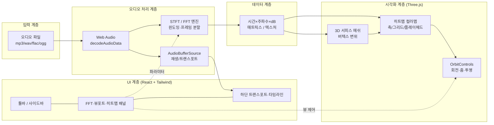
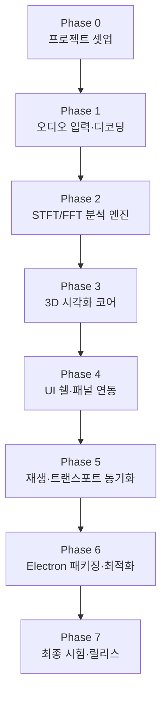
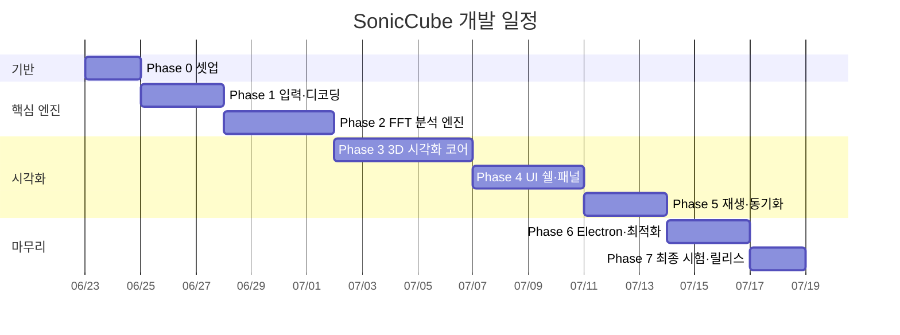

# 지침

1. 개발 내용을 단계별로 제안한다.
2. 최종 단계에서는 앱 시험에 대한 방안을 제시하고 시험이 완료되었을 때 최종 종료된다. (이것은 개발 과정의 시험과 다른, '프로젝트 종료' 단계에서의 최종 앱 시험에 대한 것임)
3. 스텝별, Phase별 개발이 필요한 경우 Mermaid 등으로 개발에 대한 전체 과정을 도식화 하여 제안한다.
4. 개발 일정을 time table로, 개발 항목별로 보여준다.

# 개발 - 프로세스

## 0. 프로젝트 개요

**제품명(가칭):** SonicCube — 3D Audio Spectrogram Viewer

오디오 파일(mp3, wav, flac, ogg 등)을 입력받아 시간(X) · 주파수(Y) · 음압레벨(Z, dB)을
3차원 입체 파형(스펙트로그램 서피스)으로 시각화하고, 재생과 동기화하여 탐색할 수 있는 데스크톱/웹 앱.

| 항목 | 내용 |
|------|------|
| **플랫폼** | 웹(브라우저) 우선 개발 → Electron 패키징(동일 코드베이스) |
| **시각화 엔진** | Three.js (WebGL) — 프로토타입과 동일 |
| **오디오 처리** | Web Audio API (`decodeAudioData`) + 오프라인 STFT/FFT |
| **UI 프레임워크** | Vite + React + TypeScript + Tailwind CSS |
| **디자인 기준** | `1. prototype design/` (DESIGN.md, code.html, screen.png) — Emerald & Gold 다크 테마 |
| **입력 포맷** | mp3 / wav / flac / ogg / m4a (브라우저 디코더 지원 범위) |

> **결정 필요(사용자 확인):** 1차 목표를 "브라우저 단독 실행"으로 두고 Electron 래핑은 Phase 6에서
> 선택적으로 진행하는 안으로 계획했습니다. Electron을 처음부터 1순위로 둘 필요가 있으면 알려주세요.

---

## 1. 기술 아키텍처

---

## 2. 단계별(Phase) 개발 계획

### Phase 0 — 프로젝트 셋업 `v0.1.0`
- Vite + React + TypeScript + Tailwind 프로젝트 초기화
- 디자인 토큰 적용: `DESIGN.md`의 색상/타이포(Geist, JetBrains Mono) → Tailwind config 이식
- 전역 버전 상수 `APP_VERSION` 정의 및 화면 표시(Settings/About)
- 폴더 구조 확정 (`/src/audio`, `/src/viz`, `/src/ui`, `/src/store`)

### Phase 1 — 오디오 입력·디코딩 `v0.2.0`
- 파일 선택(Upload File 버튼) + 드래그&드롭 입력
- `AudioContext.decodeAudioData`로 PCM 디코딩, 메타데이터(샘플레이트·비트뎁스·길이) 추출
- "CURRENT FILE" / FFT PROPERTIES 패널에 실제 값 바인딩
- 에러 처리(미지원 포맷, 손상 파일)

### Phase 2 — STFT/FFT 분석 엔진 `v0.3.0`
- 윈도잉(Hamming/Hann/Blackman) + 프레임 분할(hop size) 구현
- FFT 계산(`fft.js` 등 경량 라이브러리), 매그니튜드 → dBFS 변환
- 시간×주파수×dB 매트릭스 생성, 대용량 대비 Web Worker로 비동기 처리
- 피크 레벨 산출(PEAK LEVEL 표시)

### Phase 3 — 3D 시각화 코어 `v0.4.0`
- Three.js 씬/카메라/렌더러 + OrbitControls
- PlaneGeometry 버텍스 변위로 스펙트로그램 서피스 렌더
- 히트맵 컬러맵(-120dB ~ +6dB) 셰이더, 축 라벨(X:TIME, Y:FREQ, Z:LEVEL)
- 그리드/additive blend, 성능(인스턴싱·LOD) 고려

### Phase 4 — UI 쉘·패널 연동 `v0.5.0`
- 프로토타입 레이아웃 구현: 상단 툴바(메뉴/Live Record/Upload), 좌측 아이콘 사이드바
- VIEWPORT SETTINGS(Rotation X·Zoom·Perspective ISO/ORTHO/3D) → 3D 뷰 실시간 제어
- HEATMAP ANALYZER 범례, Glassmorphism 패널 스타일 적용
- 상태관리(Zustand 등)로 패널↔엔진↔뷰 연결

### Phase 5 — 재생·트랜스포트 동기화 `v0.6.0`
- 재생/일시정지/이전·다음/반복, 마스터 볼륨
- 타임라인 스크러버 + 타임코드, 재생 위치 플레이헤드를 3D 뷰에 동기 표시
- (선택) Live Record: 마이크 입력 실시간 스펙트로그램

### Phase 6 — Electron 패키징·최적화 `v0.7.0`
- Electron 셸 래핑(electron-builder), 로컬 파일 시스템 접근
- 번들 최적화, 대용량 오디오 메모리/성능 튜닝
- Win/(필요시 macOS) 빌드 산출물

### Phase 7 — 최종 시험·릴리스 `v1.0.0`
- 아래 "5. 최종 앱 시험 방안" 수행 → 통과 시 프로젝트 종료

---

## 3. 개발 일정 (Time Table)

> 1인 개발 기준 추정. 1 SP ≈ 0.5일.

| Phase | 개발 항목 | 산출물 | 버전 | 예상 기간 |
|-------|-----------|--------|------|-----------|
| 0 | 프로젝트 셋업·디자인 토큰 | 실행 가능한 빈 앱 셸 | v0.1.0 | 2일 |
| 1 | 오디오 입력·디코딩 | 파일 로드 + 메타 표시 | v0.2.0 | 3일 |
| 2 | STFT/FFT 분석 엔진 | 스펙트로그램 데이터 매트릭스 | v0.3.0 | 4일 |
| 3 | 3D 시각화 코어 | 3D 스펙트로그램 서피스 | v0.4.0 | 5일 |
| 4 | UI 쉘·패널 연동 | 프로토타입 동등 UI | v0.5.0 | 4일 |
| 5 | 재생·트랜스포트 동기화 | 재생 + 플레이헤드 동기 | v0.6.0 | 3일 |
| 6 | Electron 패키징·최적화 | 데스크톱 빌드 | v0.7.0 | 3일 |
| 7 | 최종 시험·릴리스 | v1.0.0 릴리스 | v1.0.0 | 2일 |
| | | | **합계** | **약 26일(5~6주)** |

---

## 4. 산출물·문서 연계
- **앱개발.md** : 각 Phase 구현 시 "앱 개발 내용"/"History"에 실제 내용 기록(버전 규칙 준수)
- **시험.md** : 각 Phase 완료 시 해당 시험 항목·절차 추가
- **수정요청.md** : 사용자 피드백/버그 수정 사이클 관리

---

## 5. 최종 앱 시험 방안 (프로젝트 종료 단계)

> 본 절은 개발 과정 중 단위 시험과 별개로, **v1.0.0 릴리스 전 최종 인수 시험(Acceptance Test)** 이다.
> 모든 항목 통과 시 프로젝트를 종료한다. 세부 절차는 `시험.md`에 동기화한다.

### 5.1 자동 시험 (스스로 수행)
| # | 시험 항목 | 판정 기준 |
|---|-----------|-----------|
| A1 | 다중 포맷 디코딩(mp3/wav/flac/ogg) | 모든 샘플 정상 로드, 메타데이터 정확 |
| A2 | FFT 결과 정합성 | 사인파 테스트 톤의 피크 주파수 오차 < 1 bin |
| A3 | 렌더 성능 | 표준 3분 트랙에서 60fps 근접(>50fps) 유지 |
| A4 | 메모리 누수 | 파일 10회 반복 로드 시 메모리 안정 |
| A5 | 빌드 무결성 | 웹/Electron 빌드 에러 0, 콘솔 에러 0 |

### 5.2 수동 시험 (사용자 수행)
| # | 시험 항목 | 판정 기준 |
|---|-----------|-----------|
| M1 | 파일 업로드/드래그&드롭 | 정상 입력 및 분석 시작 |
| M2 | 3D 회전·줌·투영 전환(ISO/ORTHO/3D) | 입력 즉시 반응, 왜곡 없음 |
| M3 | 재생/일시정지 + 플레이헤드 동기 | 오디오와 3D 위치 시각 동기 |
| M4 | 타임라인 스크럽 | 클릭 위치로 정확히 이동 |
| M5 | 디자인 일치도 | 프로토타입(screen.png)과 시각적 동등 |

### 5.3 종료 조건
- 자동 시험 A1~A5 전부 PASS
- 수동 시험 M1~M5 전부 사용자 승인
- 잔여 Critical/Major 버그 0건 → **v1.0.0 릴리스 및 프로젝트 종료**

